## Introduction

**InputGen** is a tool for automatic generation Prototype Inputs to Support Rapid Requirements Validation
. The **benefits** of InputGen are as follows:

1. **Automatic input data generation of system operations**. InputGen can automatically refactor the prototype generated by RM2PT to support generating the validated input data of the system operation.

2. **Initial data auto-loading**. InputGen contains an interface for loading initial data, which can save the time for the administrator. The initial data can be imported from external YAML file, which can be viewed and modified easily by the user.

3. **Supporting rapid requirements validation**. Compared with the original prototype generated from RM2PT, InputGen can automatically refactor the generatedthen prototype from the same *requirements model* without any templates. Then refactoried prototype can automatically generate the validated input data of the system operation, this will boost the validation process.

The video cast its feature is listed as follows (Youtube):
<iframe class="uk-width-1-3@m" width="560" height="315" src="https://youtu.be/RtPybSKmXFw" frameborder="1" allow="accelerometer; autoplay; encrypted-media; gyroscope; picture-in-picture" allowfullscreen>InputGen Youtube Video</iframe>

### InputGen Installation

#### Prerequest

InputGen is an advanced feature of **RM2PT**. We recommend you to use InputGen in RM2PT. If you don't have RM2PT, download [here](https://rm2pt.com/downloads/).

#### Online Installation

Open RM2PT, click on `Help` -> `Install New Software`

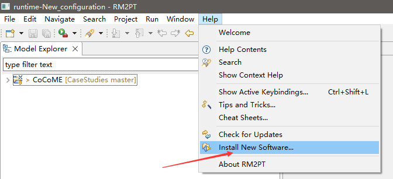

Type http://rm2pt.com/InputGen-UpdateSite in the Work with field, select RM2Doc and click Next.

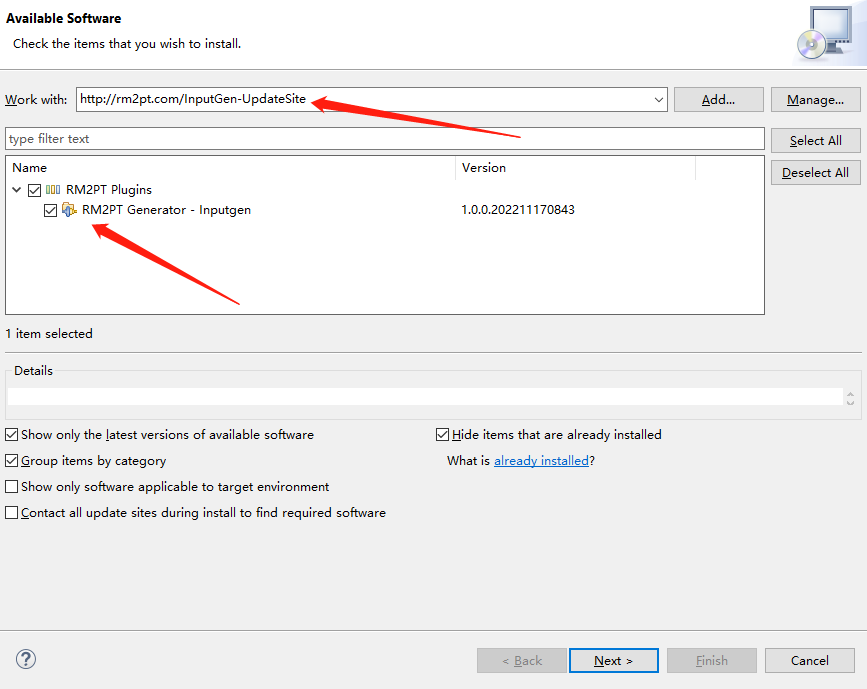

### Offline Installation

**If the update site does not work**, you can choose to install it offline. Click [here](https://github.com/RM2PT/InputGen-UpdateSite/releases/download/v1.0.0/com.rm2pt.generator.inputgen.updatesite-1.0.0-SNAPSHOT.zip) to download InputGen. Follow the steps below to install.

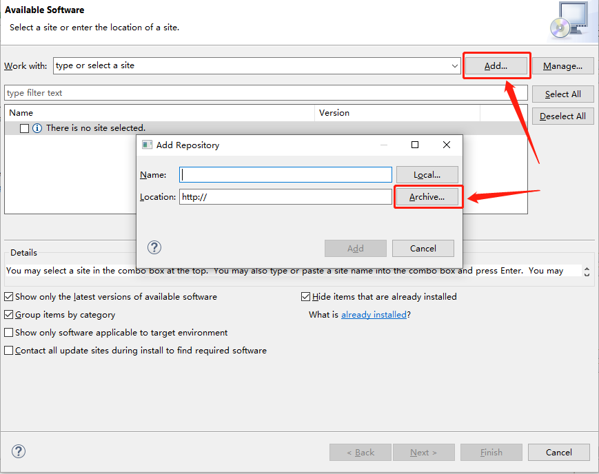

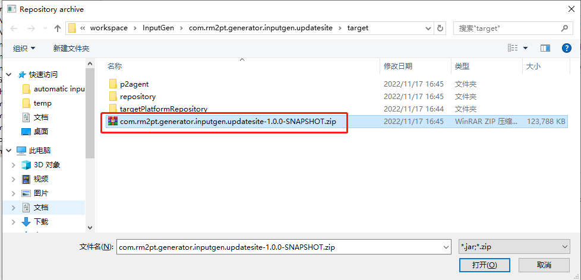

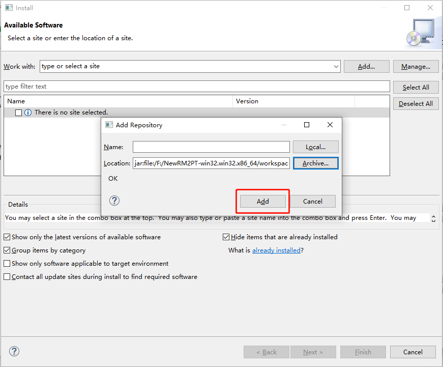

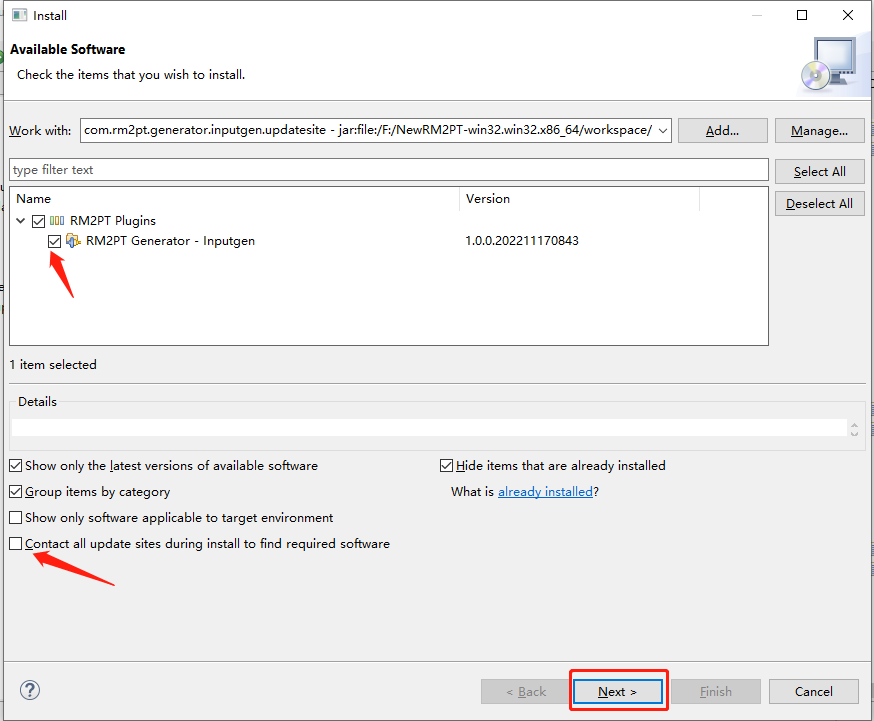

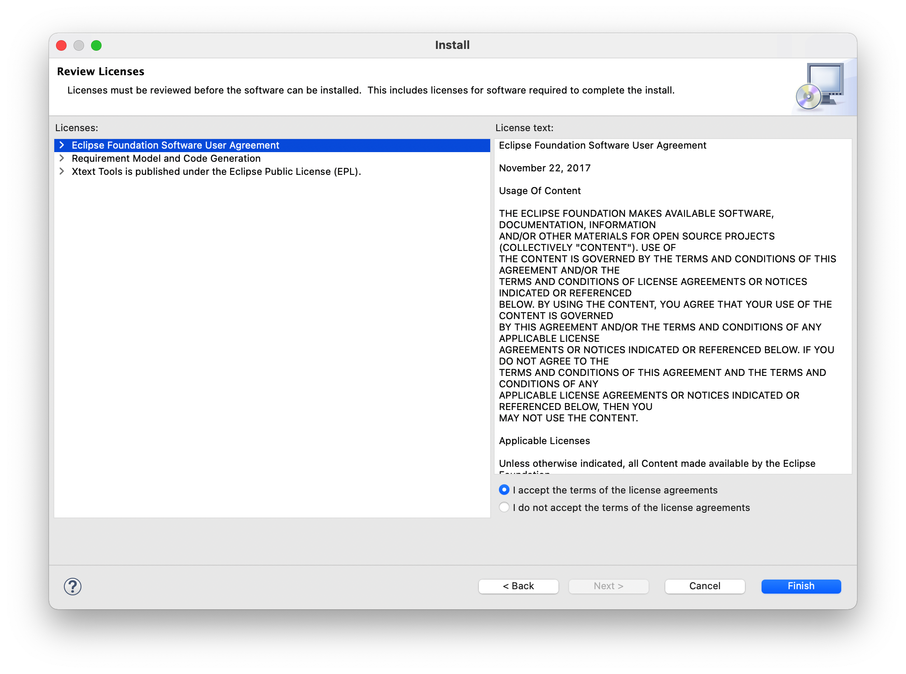

## InputGen Tutorial

### Prerequest

In order to generate the prototype inputs, you need a requirement model, the **RM2PT project**. For creating or importing a RM2PT project，you can see the tutorial [here](https://rm2pt.com/tutorial/user/create_new_project). We recommend importing RM2PT projects from Git, which is avaliable at [CaseStudies](https://github.com/RM2PT/CaseStudies). The tutorial is [here](https://rm2pt.com/tutorial/user/import_rm2pt_project).

### Input of InputGen — Requirements Model

The input to InputGen is a UML requirements model with OCL constraints. The model includes: a conceptual class diagram, a use case diagram, system sequence diagrams, contracts of and system operations.

- **A conceptual class diagram:** A conceptual class diagram is a concept-relation model, which illustrates abstract and meaningful concepts and their relations in the problem domain, in which the concepts are specified as classes, the relations of the concepts are specified as the associations between the classes, and the properties of the concepts are specified as the attributes of the classes.

- **A use case diagram:** A use case diagram captures domain processes as use cases in terms of interactions between the system and its users. It contains a set of use cases for a system, actors represented a type of users of the system or external systems that the system interacts with, the relations between the actors and these use cases, and relations among use cases.

- **System sequence diagrams:** A system sequence diagram describes a particular domain process of a use case. It contains the actors that interact with the system, the system and the system events that the actors generate, their order, and inter-system events. Compared with the sequence diagram in design models, a system sequence diagram treats all systems as a black box and contains system events across the system boundary between actors and systems without object lifelines and internal interactions between objects.
- **Contracts of system operations:** The contract of a system operation specifies the conditions that the state of the system is assumed to satisfy before the execution of the system operation, called the pre-condition and the conditions that the system state is required to satisfy after the execution (if it terminated), called the post-condition of the system operation. Typically, the pre-condition specifies the properties of the system state that need to be checked when system operation is to be executed, and the postcondition defines the possible changes that the execution of the system operation is to realize.

### 1) Generate a prototype from the requirement model
After you import a requirements model, first, we use the RM2PT to generate a prototype from the requirements model by right click on `cocome.remodel` -> `RM2PT`-> `OO Prototype`-> ` Generate Desktop Prototype`

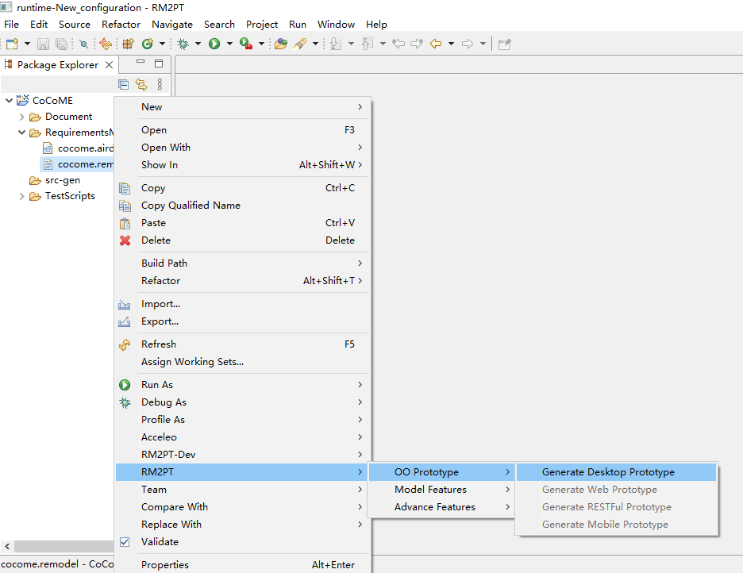

### 2) Run the InputGen tool to refactor the prototype
after you generate a prototype, we use the InputGen to refactor the prototype from the requirements model by right click on `cocome.remodel` -> `RM2PT-dev`-> `InputGen`, and update the project.

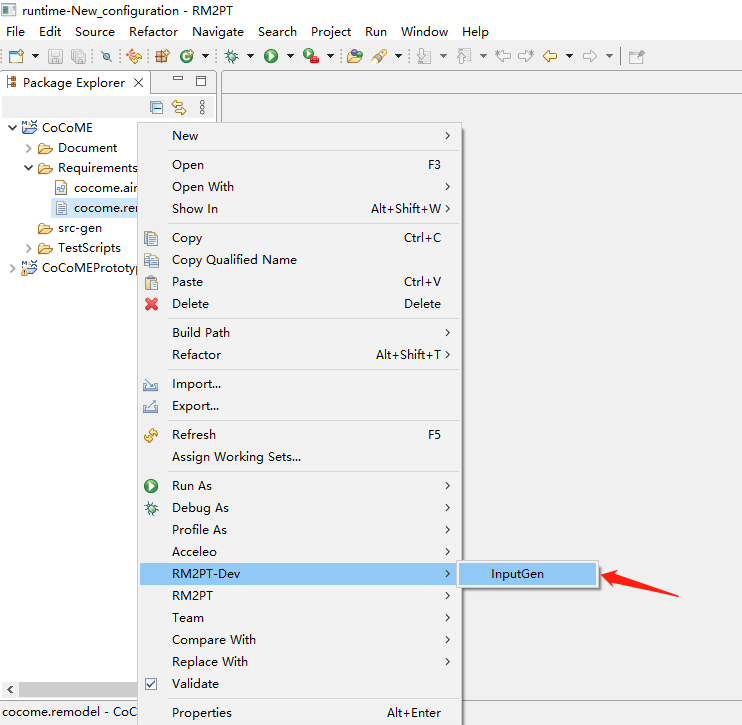

### 3) The third step is to run the refactored prototype
Run the refactored prototype to validate the requirements by right click on `COCOMEPrototype` -> `pom.xml`-> `run`-> `maven build`
.

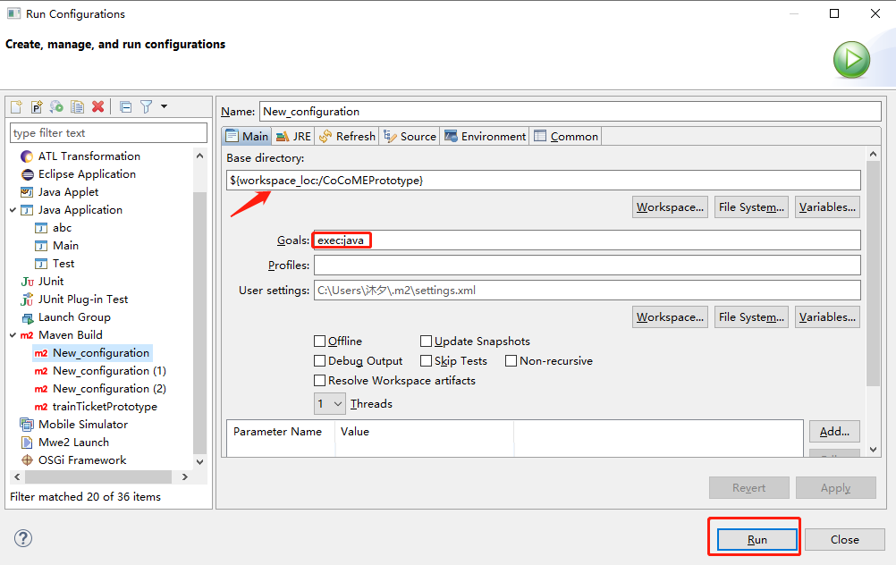

### 4) Importing the initial data
Before using the prototype to validate the requirements, we can use the Load File button to automatically load the initial data through the external interface, without manually adding it after modeling the administrator. We provide an external CoCoME yaml file, you can click [here](https://github.com/RM2PT/InputGen-UpdateSite/releases/download/v1.0.0/test.yaml) to download.

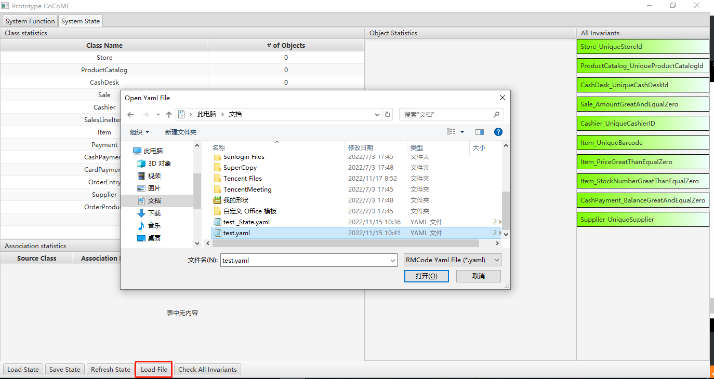

### 5) You can use the refactored prototype to validate the requirements.

### The Output of InputGen

After automatically refactoring and enhancing the generated prototype by the tool InputGen, the enhanced prototype contains two advantages as follows:

- **Automatic input data generation of system operations**. The enhanced prototype can automatically generate a validated input data of the system operations for requirement validation. In the system operation input panel, two buttons and a text box click event are added. 

- **Initial data auto-loading**. Int the system state panel, you can use the Load File button to automatically load the initial data through the external interface, without manually adding it after modeling the administrator.

### For example
 In the system operation enterItem, you can choose to click the LoadFromState button to generate input data, if you think that the input data does not meet your requirements, you can also click the input box to choose other candidates. Moreover, you can click the InputReset button to reset all inputs and manually input them by yourself.

The image below shows a part of CoCoME's automatic input data generation of the system operation enterItem. For more details, please see [CaseStudies](https://github.com/RM2PT/CaseStudies).
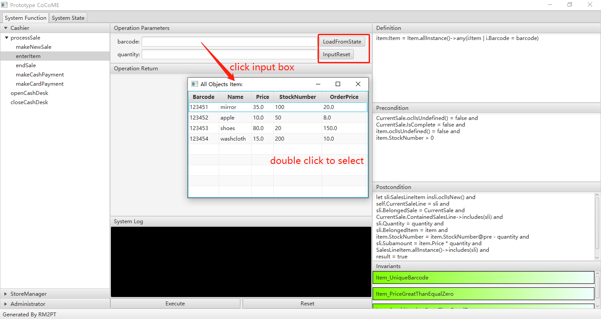
