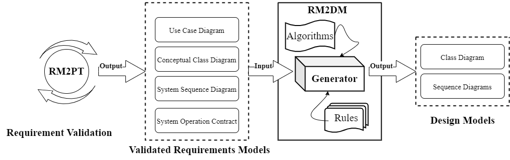
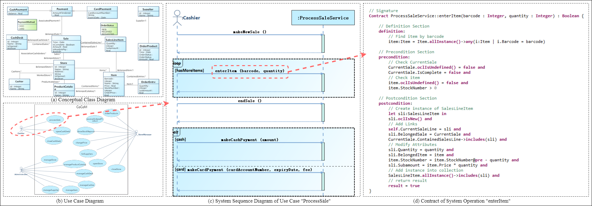
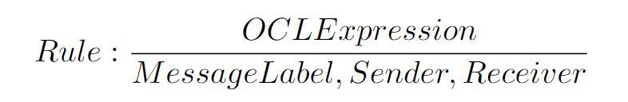
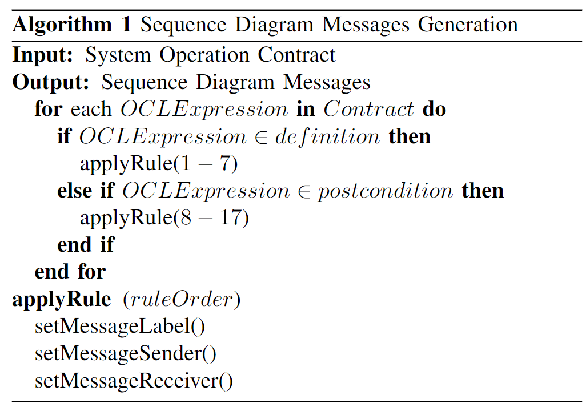
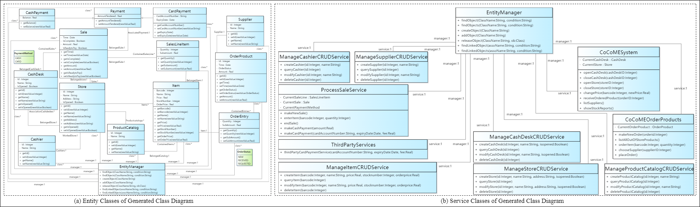
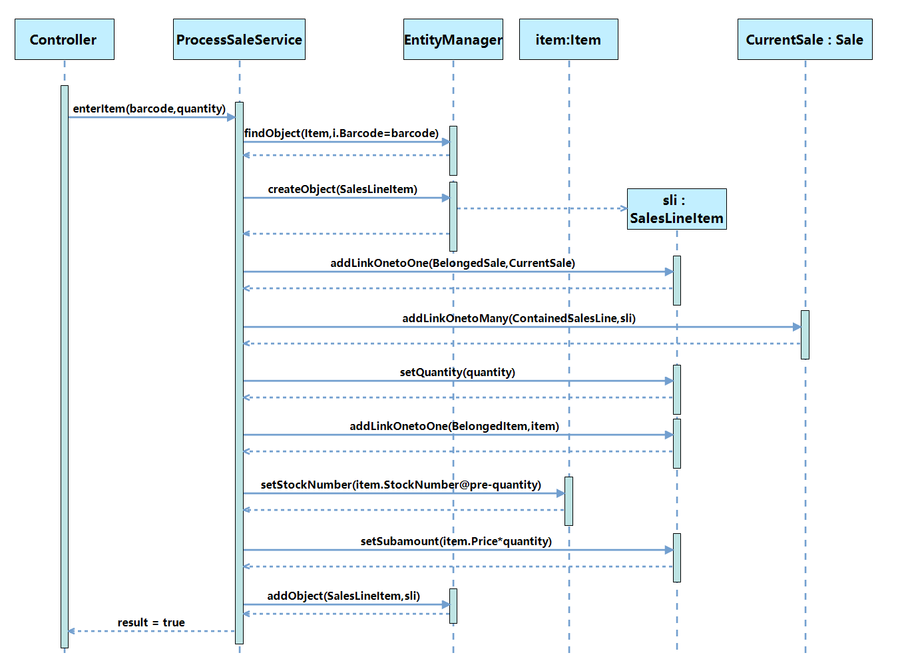

Download and use of RM2DM can be found [here](https://rm2pt.com/advs/rm2dm).

### Introduction

**RM2DM** is a tool for automatic generation of *design models* from  *requirements models*. The **benefits** of RM2DM are as follows:

1. Automatic generation of the class diagram from UML requirements models.
2. Automatic generation of sequence diagrams for each system operation.

### Input of RM2DM — Requirements Model

The input to RM2DM is a UML requirements model with OCL constraints. The model includes: a conceptual class diagram, a use case diagram, system sequence diagrams, contracts of system operations.

- **A conceptual class diagram:** A conceptual class diagram is a concept-relation model, which illustrates abstract and meaningful concepts and their relations in the problem domain, in which the concepts are specified as classes, the relations of the concepts are specified as the associations between the classes, and the properties of the concepts are specified as the attributes of the classes.

- **A use case diagram:** A use case diagram captures domain processes as use cases in terms of interactions between the system and its users. It contains a set of use cases for a system, actors represented a type of users of the system or external systems that the system interacts with, the relations between the actors and these use cases, and relations among use cases.

- **System sequence diagrams:** A system sequence diagram describes a particular domain process of a use case. It contains the actors that interact with the system, the system and the system events that the actors generate, their order, and inter-system events. Compared with the sequence diagram in design models, a system sequence diagram treats all systems as a black box and contains system events across the system boundary between actors and systems without object lifelines and internal interactions between objects.

- **Contracts of system operations:** The contract of a system operation specifies the conditions that the state of the system is assumed to satisfy before the execution of the system operation, called the pre-condition and the conditions that the system state is required to satisfy after the execution (if it terminated), called the post-condition of the system operation. Typically, the pre-condition specifies the properties of the system state that need to be checked when system operation is to be executed, and the postcondition defines the possible changes that the execution of the system operation is to realize.

### Two main features
RM2DM takes validated requirements models as input and generates EMF compliant UML design models consisting of a class diagram and sequence diagrams. The class diagram describes the static structure and sequence diagrams are generated for each system operation, describing the dynamic behavior of the system.

#### Generation of Class Diagram

RM2DM can **generate class diagram** based on the **conceptual class diagram and system sequence diagram** in the requirements model. Three rules are defined.

- **Preserve the Classes and Associations:** The first rule is to preserve the associations between classes and classes in the conceptual class diagram and add GET/SET methods corresponding to the class attributes. This design is because the relationships between classes and classes in the conceptual class diagram in the requirement model are naturally consistent with the actual situation, and this part should remain the same. Otherwise, relationship errors or missing relationships will occur.
- **Generate Service Classes:** The second rule is to encapsulate all use-case-related system operations into new Service classes based on the use case diagram (including use cases) and the system sequence diagrams (including system operations related to the use cases). The classes generated by this rule will serve as the Service layer and provide services. The service classes initiate system operations, and then objects within the system collaborate to complete the system operations.
- **Generate Entity Manager Class:** The third rule is to create a new Entity Manager class related to all other classes to add, delete, modify, and query objects. This class should therefore have primitive operations related to the addition, deletion, modification and query of objects.

#### Generation of Sequence Diagrams

There are three sections in system operation contract.

- **Definition Section:** In the definition section, the objects used jointly by the precondition section and the post-condition section are defined.

- **Precondition Section:** The precondition specifies the properties of the system state that need to be checked when system operation is to be executed. In addition to the checking of objects and attributes shown in Figure 1 (c), the precondition also includes the checking
  of links between objects.
- **Post-condition Section:** The post-condition defines the possible changes that the execution of the system operation is to realize. In addition to creating and adding objects, adding links between objects, and modifying the attributes of objects as shown in Figure 2, the postconditions include the deletion of objects and the removal of links between objects.

The definition and postcondition parts of the system operation contract describe the system’s dynamic behavior. The OCL statements in definition and postcondition can be converted into messages in the sequence diagram. In order to transform OCL statements in definition and postcondition into messages, a total of 17 transformation rules are defined. Transformation
rules are presented in this form:

The transformation rule contains two parts: the above is an OCL expression in the contracts, and the bottom part is the generated message and the message’s sender and receiver. Algorithm 1 shows how to apply the rules to generate
messages from system operation contract.

### CoCoME Case Study

To illustrate the RM2DM’s capabilities, CoCoME is used as an example to demonstrate the requirements model, and the corresponding generated design model.

The image below shows a part of CoCoME's design model. For more details, please see https://github.com/RM2PT/CaseStudies.

#### Generated Class Diagram

#### Generated Sequence Diagram 
