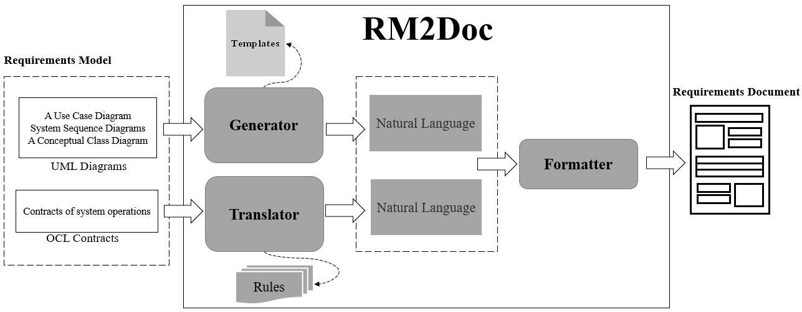
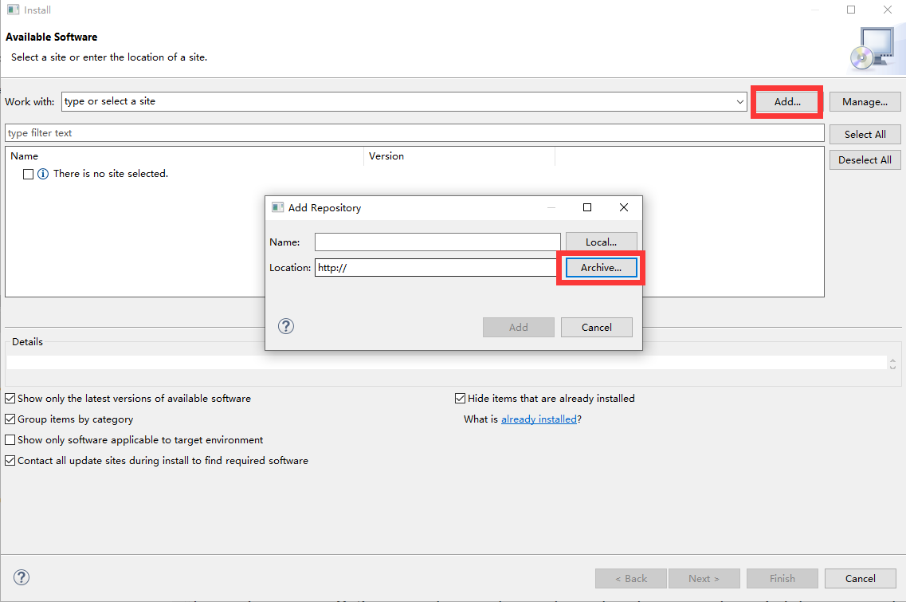
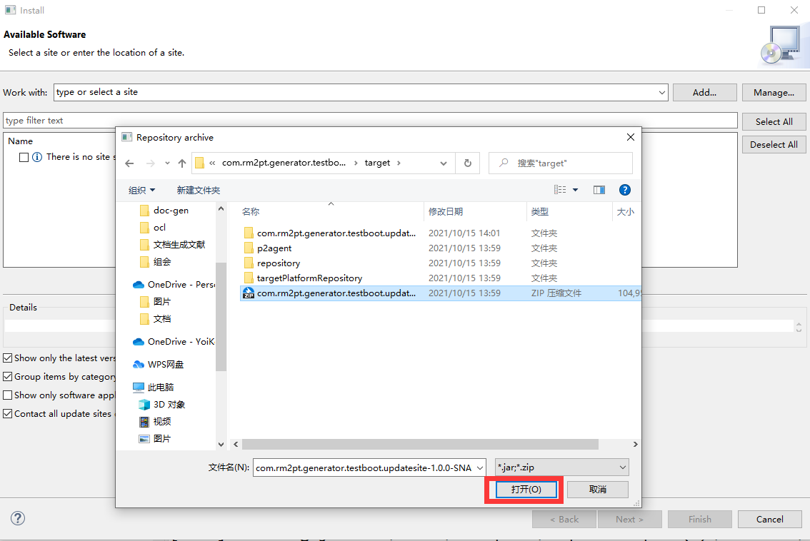
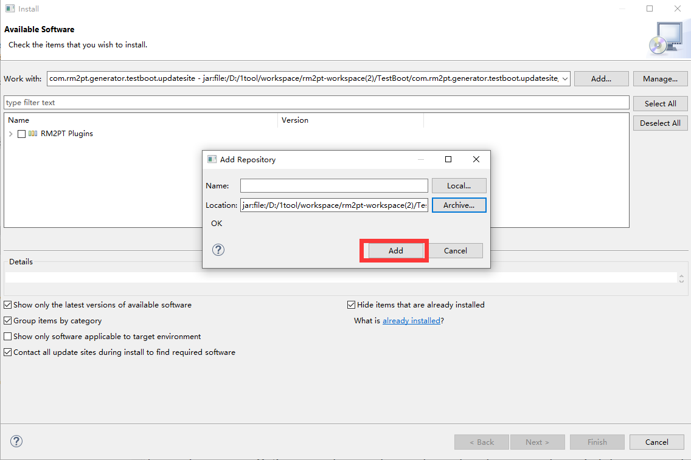
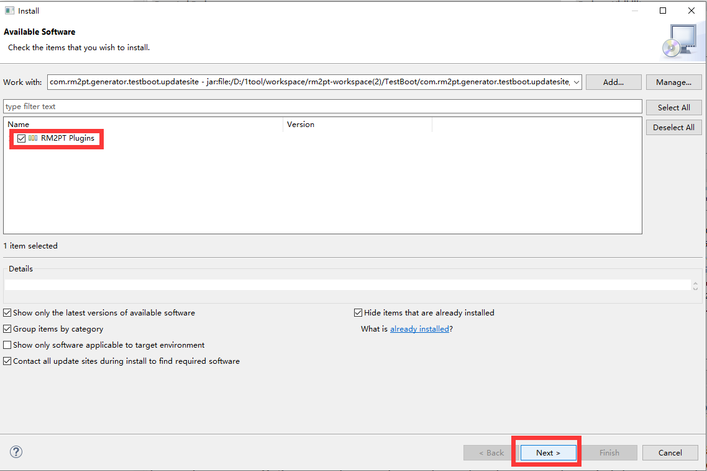
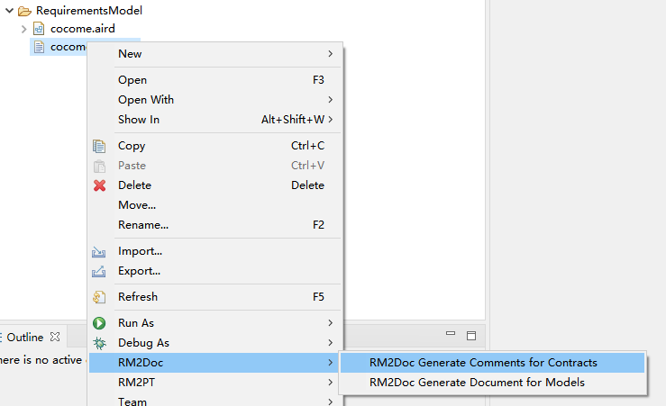
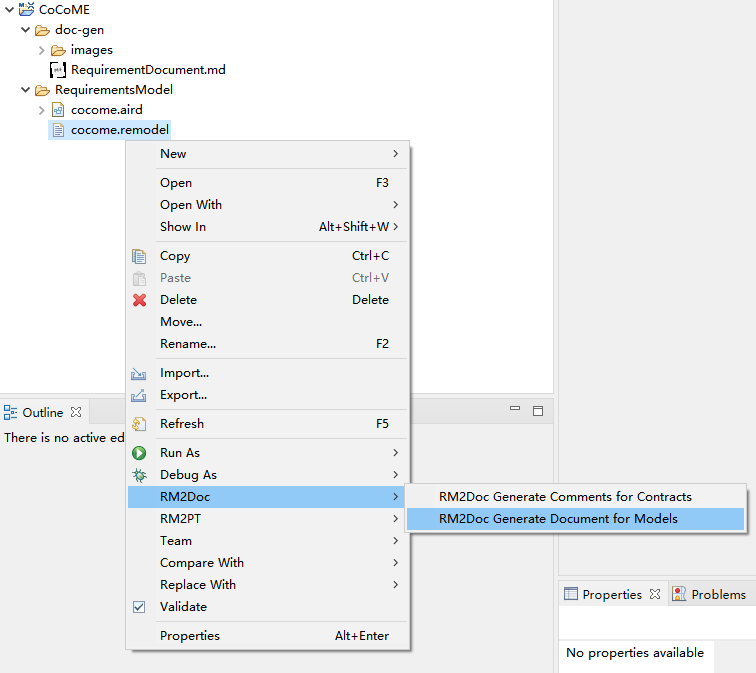

## RM2Doc

### Introduction

RM2Doc is a tool for automatic generation of a requirements document from a requirements model.

### Use of RM2Doc

##### Download

Click [here](https://github.com/RM2PT/RM2PT.github.io/blob/master/page/rm2doc/RM2Doc%20for%20RM2PT-win32.win32.x86_64.zip) to download.

##### Install

Install in rm2pt, if you don't have rm2pt, [download here](https://github.com/RM2PT/Release/releases)

##### Create or import a project

For creating or importing a RM2PT project，you can see the tutorial [here](https://rm2pt.com/tutorial/user/create_new_project).

##### Generate comments for contracts

After you add a requirements model, you can generate comments for contracts by right click on `cocome.remodel` -> `RM2Doc`-> ` RM2Doc Generate comments for contracts`

Refresh your remodel file to see the generated comments

##### Generate a document

You can generate document by right click on `cocome.remodel` -> `RM2Doc` -> `RM2Doc Generate document for models`

The generated document is in the doc-gen folder

