### Download and Installation

#### Need

RM2Doc is an advanced feature of **RM2PT**. We recommend you to use RM2Doc in RM2PT. If you don't have RM2PT, download [here](https://rm2pt.com/downloads/).

#### Installation

Open RM2PT, click on `Help` -> `Install New Software`

Type `https://github.com/RM2PT/RM2EIS-UpdateSite` in the `Work with` field, select RM2EIS and click Next.

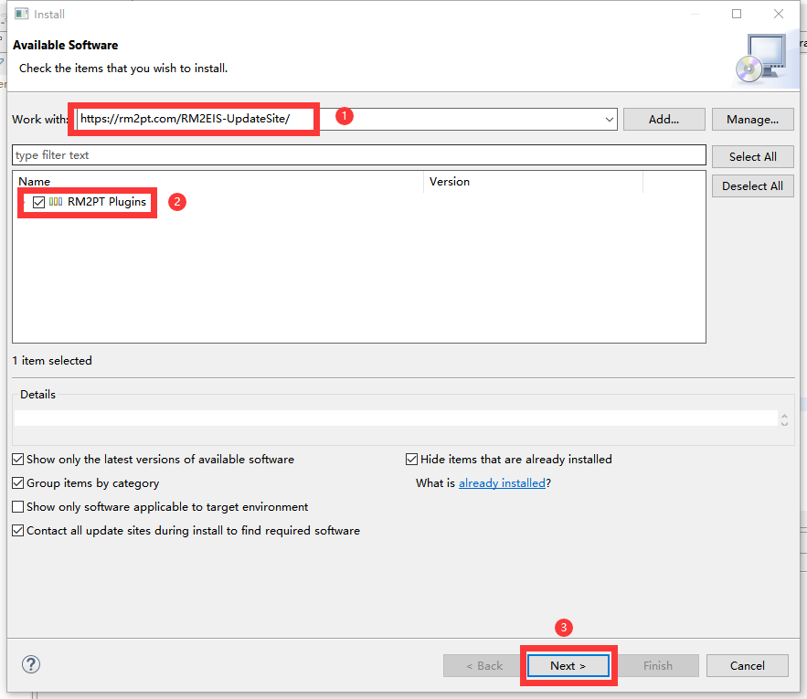

**If the update site does not work**, you can choose to install it offline. Click [here](https://github.com/RM2PT/RM2EIS-UpdateSite/archive/refs/tags/v1.3.zip) to download RM2EIS. Follow the steps below to install.

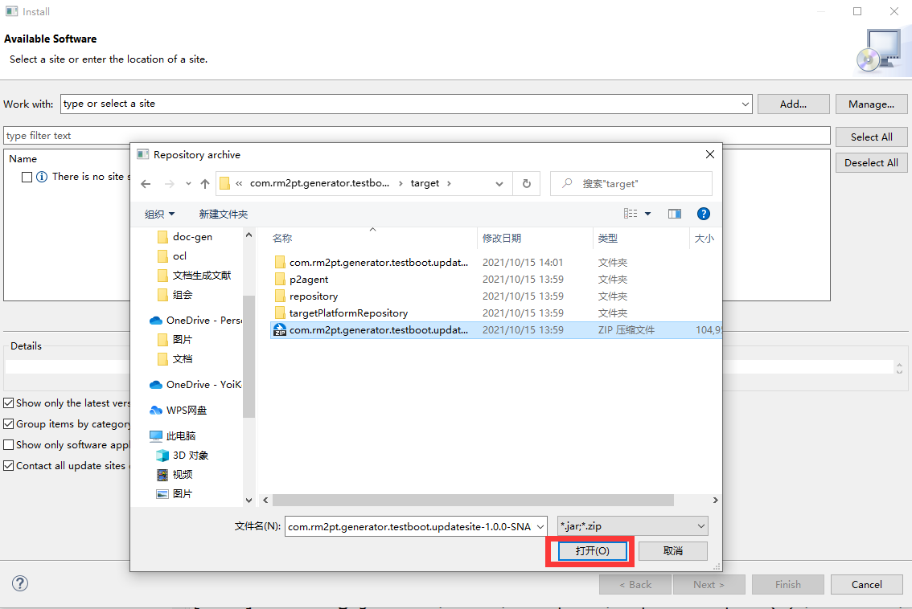

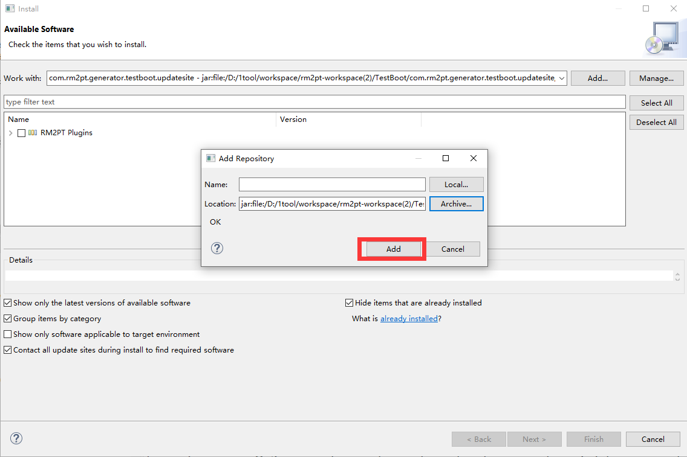

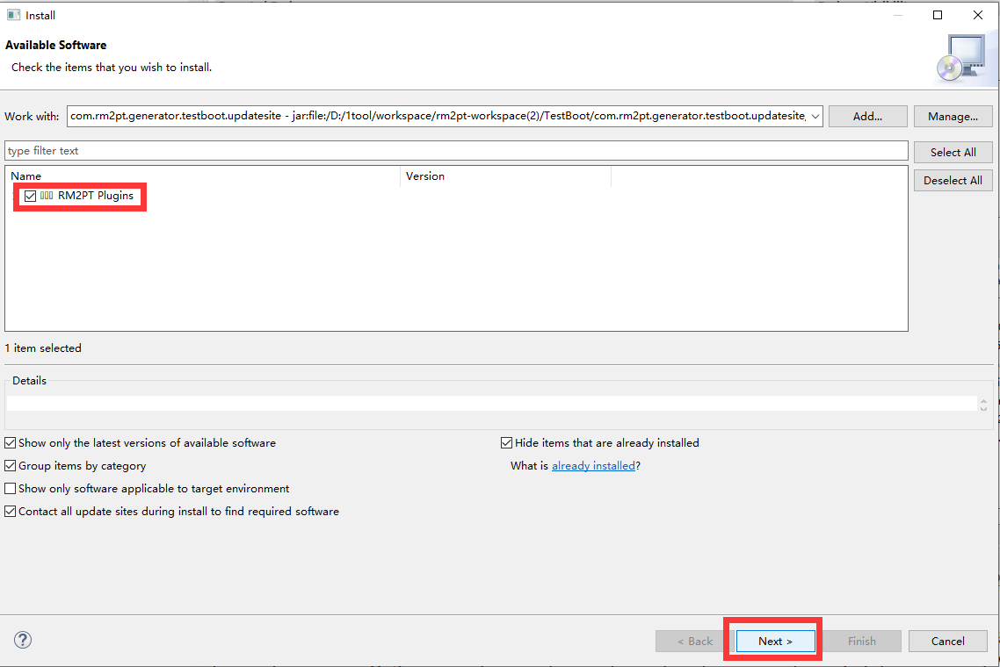

### Use of RM2EIS

#### Need

In order to run an EIS, you need to prepare a local kubernetes environment first. It is recommended to download [docker-desktop](https://www.docker.com/products/docker-desktop/) and open the k8s environment.
You may also need a readily available requirements model, where you can fetch at [case](https://github.com/LemonForeast/RM2EIS_CASE). Of course, you can do it yourself by following the [tutorial](https://rm2pt.com/tutorial/user/create_new_project).

#### Generate EIS

Take the CoCoME example as a demonstration, and import it into the workspace first.
Then, right click on `cocome.remodel` -> `RM2PT`-> ` Advance Features`-> ` Generate Springboot Application` and then make some configuration.

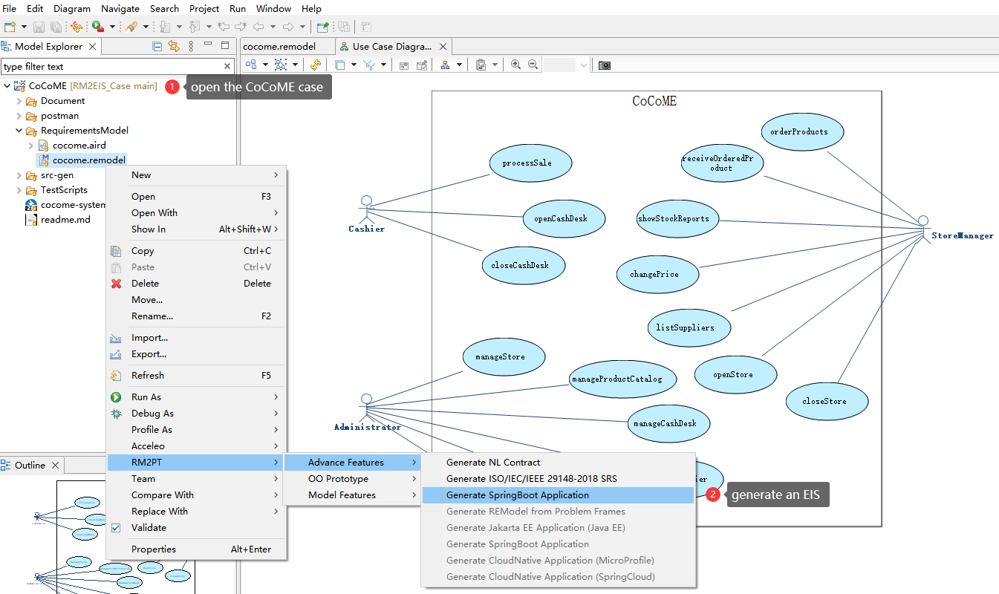

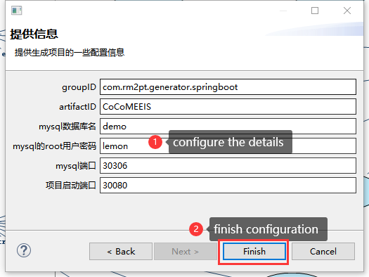

Wait until the EIS is generated.

#### Start EIS

Use the built-in startup configuration of eclipse. Or you can run `mvn clean package k8s:deploy` in the root directory.

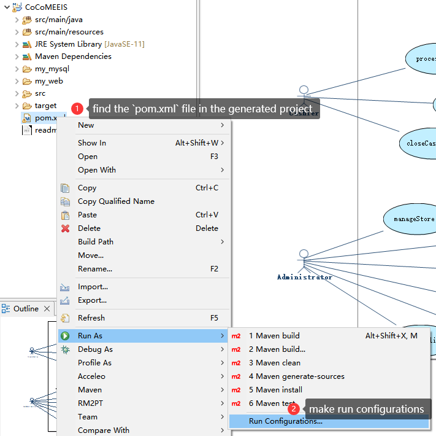

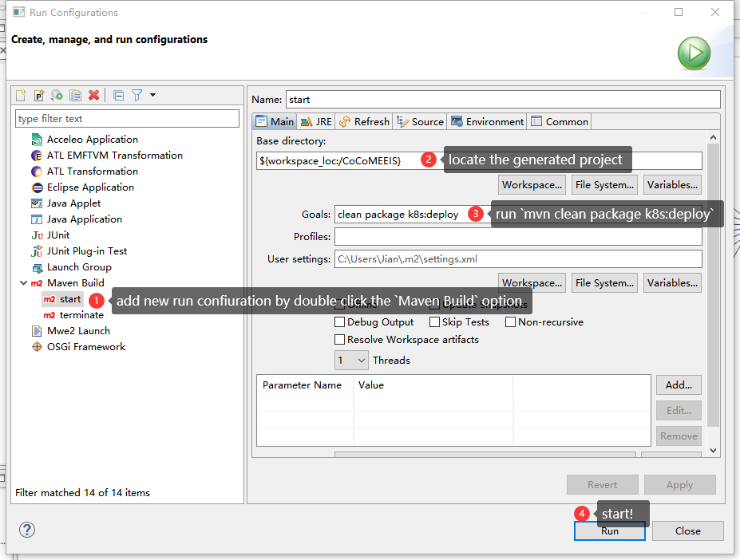

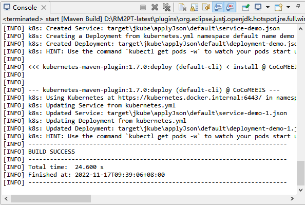

Now you can inspect the demo through the panel or use the instrction `kubectl get pod`

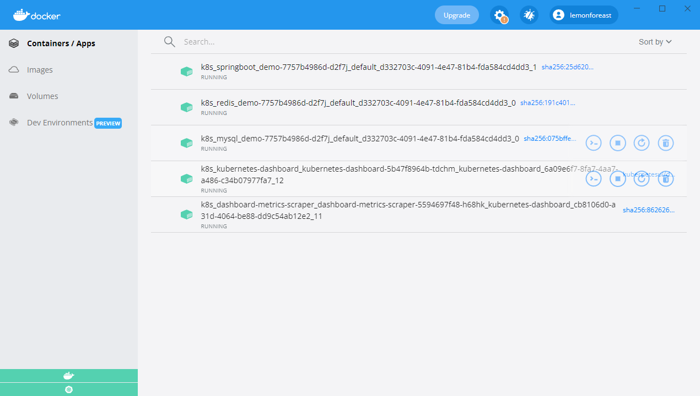

#### Access the EIS

Open the api page and try yourself. You can get more information about how to use such page at [swagger](https://swagger.io/).

Or you may want to connect to the DB, just type your port, your username and your password as shown in figure.

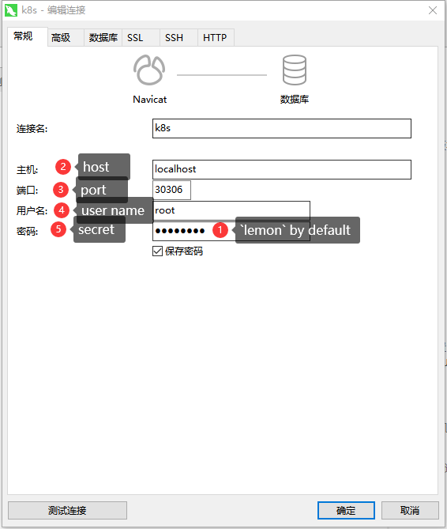

#### Stop EIS

Use the built-in startup configuration of eclipse. Or you can run `mvn k8s:undeploy` in the root directory.

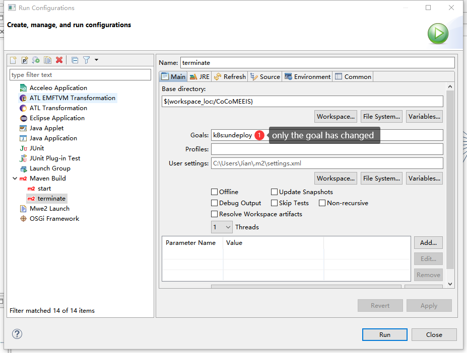