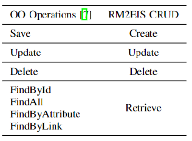

\---

layout: page

title: RM2EIS

permalink: /rm2eis/

\---

Download and use of RM2EIS can be found [here](https://rm2pt.com/advs/rm2eis).

**### Introduction**

**RM2EIS** is a tool for automatic generation of an **EIS** from a **requirements model**. The **benefits** are as follows:

- It proves consistent quality
- No understanding bias based on validated demand generation
- One-click generation does not bring extra time and cost
- Prevent loopholes caused by poor manual consideration

**### Input of RM2EIS — Requirements Model**

The input to RM2Doc is a UML requirements model with OCL constraints. The model includes: , a use case diagram, system sequence diagrams, contracts of and system operations.

\- ***\*A conceptual class diagram:\**** A conceptual class diagram is a concept-relation model, which illustrates abstract and meaningful concepts and their relations in the problem domain, in which the concepts are specified as classes, the relations of the concepts are specified as the associations between the classes, and the properties of the concepts are specified as the attributes of the classes.

\- ***\*A use case diagram:\**** A use case diagram captures domain processes as use cases in terms of interactions between the system and its users. It contains a set of use cases for a system, actors represented a type of users of the system or external systems that the system interacts with, the relations between the actors and these use cases, and relations among use cases.

\- ***\*System sequence diagrams:\**** A system sequence diagram describes a particular domain process of a use case. It contains the actors that interact with the system, the system and the system events that the actors generate, their order, and inter-system events. Compared with the sequence diagram in design models, a system sequence diagram treats all systems as a black box and contains system events across the system boundary between actors and systems without object lifelines and internal interactions between objects.

\- ***\*Contracts of system operations:\**** The contract of a system operation specifies the conditions that the state of the system is assumed to satisfy before the execution of the system operation, called the pre-condition and the conditions that the system state is required to satisfy after the execution (if it terminated), called the post-condition of the system operation. Typically, the pre-condition specifies the properties of the system state that need to be checked when system operation is to be executed, and the postcondition defines the possible changes that the execution of the system operation is to realize.

**### Output of RM2EIS — EIS**

**EIS**(Enterprise Information System) integrates business logic, improving business productivity and shortening service, product development, and marketing life cycles.

EIS is important in industrial and commercial domain, but it can only be formally put into use after developement, which is time-consuming, laborious, and error-prone.

**Layer structure** is common in EIS, where:

- **Controller** layer responsible for mapping requests to corresponding service handlers
- **Service** layer responsible for the processing of business logic
- **Repository** layer provides data access operations and provides caching processing
- **Entity** layer maps entity classes to tables in the database

**### Features**

#### Overview
RM2EIS takes the requirement model as input and uses a transformation algorithm to process and parse the user requirement information contained in the requirement model. For the OCL expressions contained in the system operation contract, RM2EIS needs transformation rule to transform them into the system operation code that drives the running of the EIS. Finally, the method outputs a complete and executable
EIS, which can be further deployed in K8S.

##### SpringBoot-based EIS Generation
**Mapping OO operations to CRUD:**
For EIS, CRUD is the most basic operation, so RM2EIS improves OO methods as shown.

**Following the Restful style:** 

RESTFUL is a design style for web applications based on HTTP and can be defined using JSON format, which is suitable for EIS scenarios. In a RESTful web service, each resource has an address. The resource is the target of the method call, and the method list is the same for all resources.

**Generating from Requirements Model:** 

Most of the work is based on a more detailed design model. RM2EIS is generated from a requirements model that contains only external information and no internal information. The template
generation method is used, which includes design patterns, development experience, and industry standards. 

##### K8S Auto Deployment

To facilitate users, RM2EIS can generate supporting deployment scripts, including code packaging and containerization, service orchestration, and environment initialization. Users can configure the service information to generate corresponding scripts. In addition to deploying the EIS locally, RM2EIS supports one-click cloud migration With the help of the jkube2 plug-in by integrating the deployment into the maven phase. With containerized management, EIS can easily implement elastic services, error tracing and other features. The cloud service is unaware of Restful interfaces exposed to the outside. Accordingly, RM2EIS also provides a cease-of-deployment instruction.

